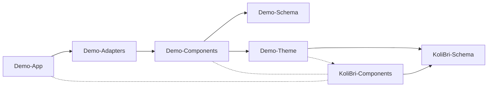

# Stencil peproduction [#5358](https://github.com/ionic-team/stencil/issues/5358)

## Bug Report

We get the following error after updating Stencil to version 4.12:

```shell
[53:59.8]  @stencil/core
[54:00.3]  v4.12.2 🎯
[54:00.5]  testing spec files
[54:00.6]  jest args: --spec --json --outputFile dist/jest-test-results.json --max-workers=8
 FAIL  src/components/button/test/snapshot.spec.tsx
  ● Test suite failed to run

    ENOENT: no such file or directory, open 'node:crypto'

      at Runtime.readFile (../node_modules/.pnpm/jest-runtime@26.6.3/node_modules/jest-runtime/build/index.js:1987:21)
      at ../node_modules/.pnpm/@stencil+core@4.12.2/node_modules/@stencil/core/compiler/stencil.js:55:21
      at Object.<anonymous> (../node_modules/.pnpm/@stencil+core@4.12.2/node_modules/@stencil/core/compiler/stencil.js:277787:3)

Test Suites: 1 failed, 1 total
Tests:       0 total
Snapshots:   0 total
Time:        4.386 s
Ran all test suites.
Test results written to: dist/jest-test-results.json

 ELIFECYCLE  Test failed. See above for more details.
```

## Steps to reproduce

One-line command:

```shell
pnpm clean && pnpm i && cd components && pnpm build:deps && pnpm i @stencil/core@4.11.0 && pnpm test && pnpm i @stencil/core@4.12.2 && pnpm test && cd ..
```

1. Clone the repository: `git clone https://github.com/deleonio/kolibri-library.git`
2. Install the dependencies: `pnpm i`
3. Switch in `components` folder: `cd components`
4. Build monorepo: `pnpm build:deps`
5. Install Stencil to version 4.11: `pnpm i @stencil/core@4.11.0`
6. Run the tests: `pnpm test`
7. Update Stencil to version 4.12: `pnpm i @stencil/core@4.12.2`
8. Run the tests again: `pnpm test`
9. Back to the root folder: `cd ..`

---

## Own library project

This is a library project to build your own component library for your company based on **_KoliBri_**.

## Owerview



The **_Demo_** application depends on the **_Demo_** components. The **_Demo_** components depend on the **_Demo_** theme that stylises the **_KoliBri_** components. The **_Demo_** theme has a peer dependency to the **_KoliBri_** components. This means that the **_Demo_** application must also install **_KoliBri_** components.

In effect, the app only needs to install two decoupled packages (**_Demo_** and **_KoliBri_** components or the adapters) to get everything it needs. The theme of the **_KoliBri_** components is implicitly included in the **_Demo_** components.

